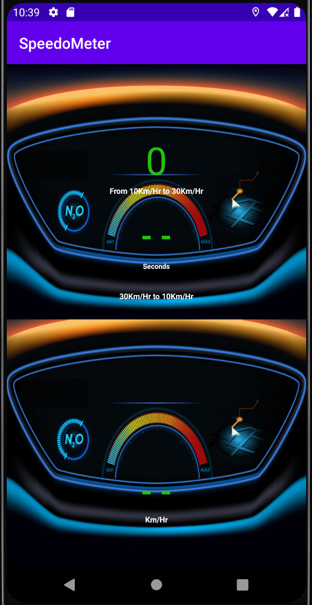

# SpeedoMeter-Android
SpeedoMeter android app that measures your moving speed using Google Location Services

      

## Libraries Used : 

* Google Play Services (Location) : https://developers.google.com/android/guides/setup    

* EasyPermissions : https://github.com/googlesamples/easypermissions

